# MedAssist

<!--  -->

MedAssist is a mobile and web application that aims to make the lives of patients and doctors easier and safer. It is designed to help patients avoid unwanted side effects caused by medications by predicting potential side effects of new drug compositions using machine learning. MedAssist also takes input from doctors and adds their approval or disapproval of the suggestions to its database. They can also add side effects that they think might show in patients with specific health conditions like heart disease, diabetes, etc.

## How It Works

The MedAssist app uses machine learning technologies to predict the side effects of new drug compositions. The machine learning model is trained on a dataset that maps various drug compositions with their side effects. Once the app predicts the side effects, it suggests alternative medicines that do not pose the threat of those side effects.

Patients can verify those alternative medicines with an online consultation with a doctor. Once the doctor verifies the suggestions, the patients will get a digital prescription that they can use to buy medicines.

## Technologies Used

The MedAssist app is built using various in-demand technologies like:

- NextJS
- NodeJS
- MongoDB
- React Native with Expo
- Express

## Features

The following are the key features of the MedAssist app:

- Prediction of potential side effects of new drug compositions
- Suggestion of alternative medicines that do not pose the threat of those side effects
- Online consultation with a doctor to verify alternative medicines
- Digital prescription for buying medicines
- Easy-to-use interface
- Doctor input for approving or disapproving of suggestions and adding side effects related to specific health conditions

## App Screenshots

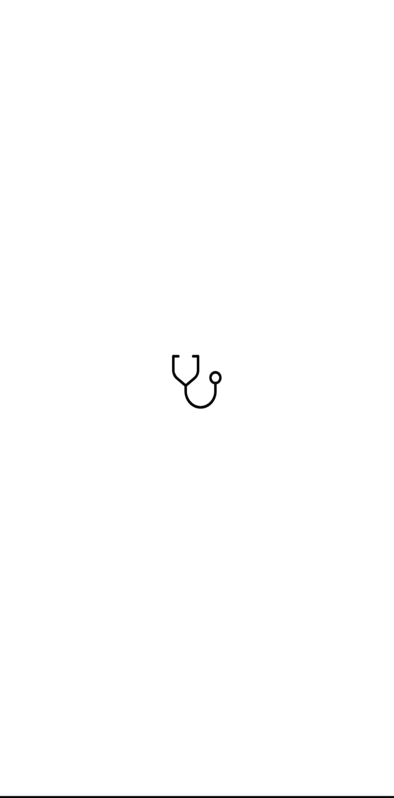
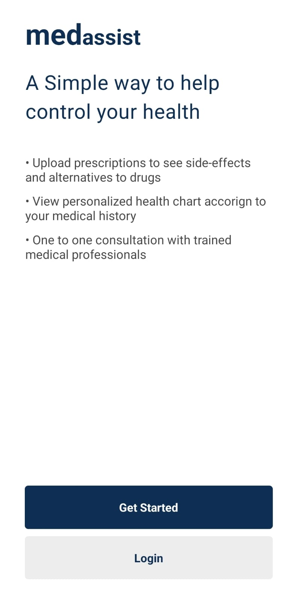
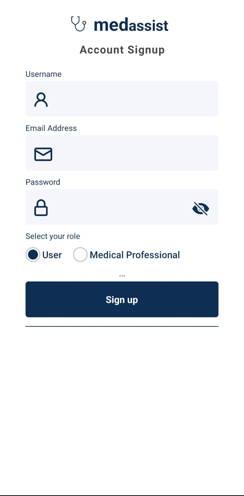
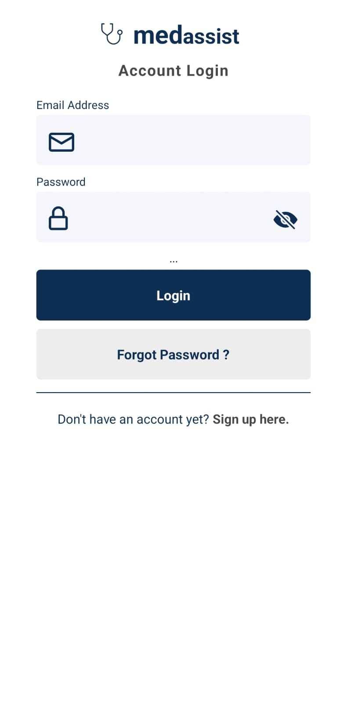
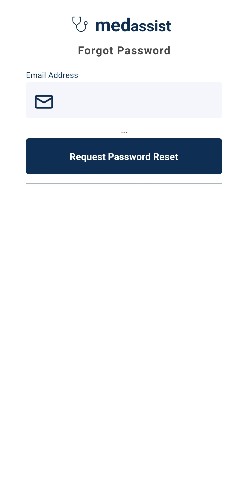
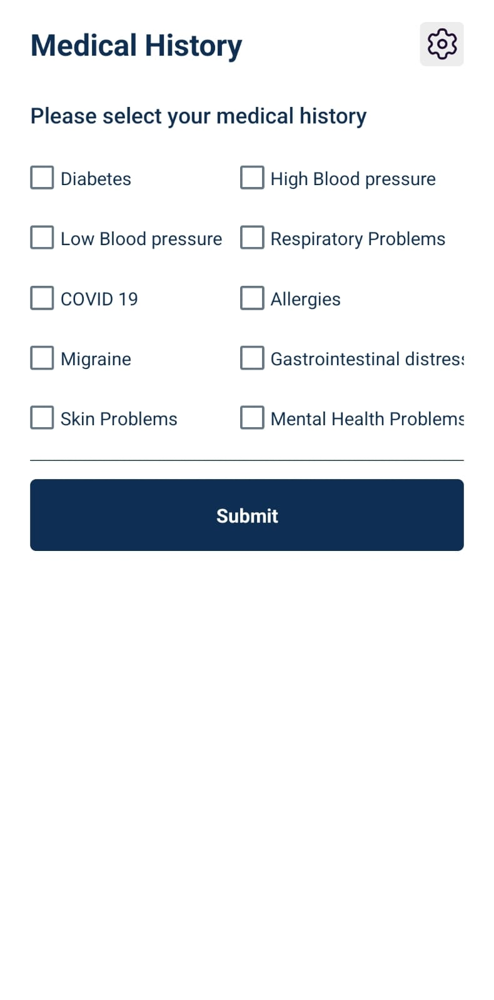
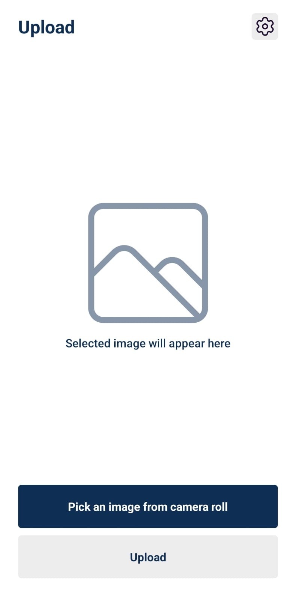
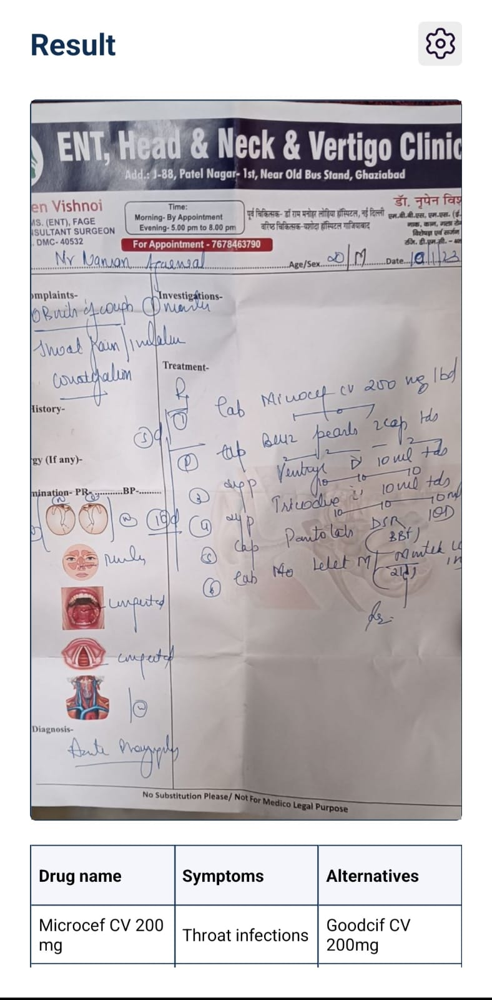
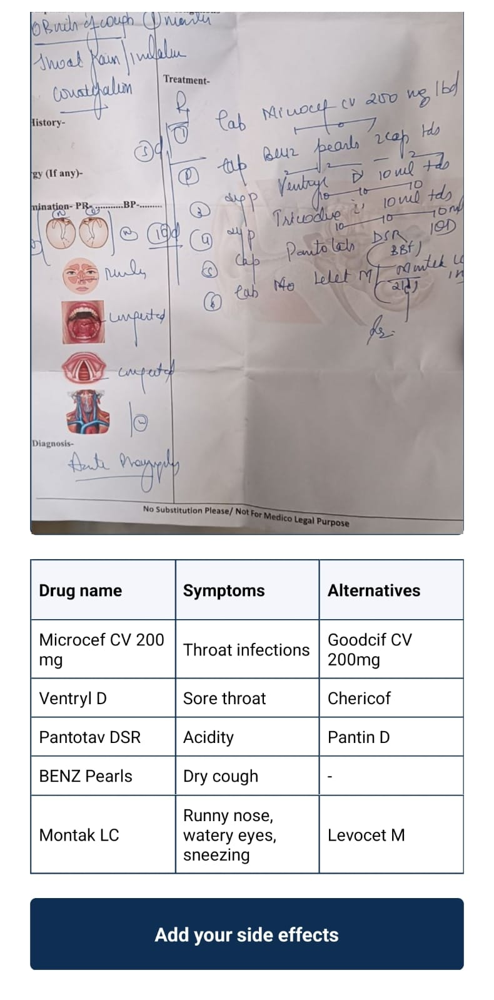
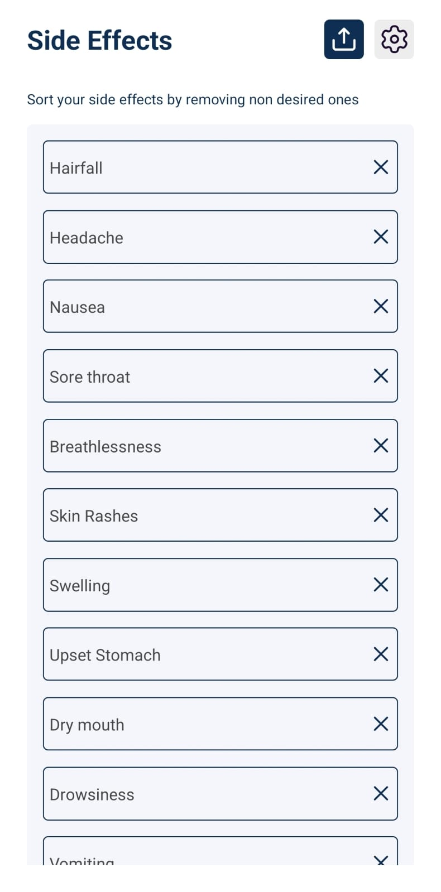
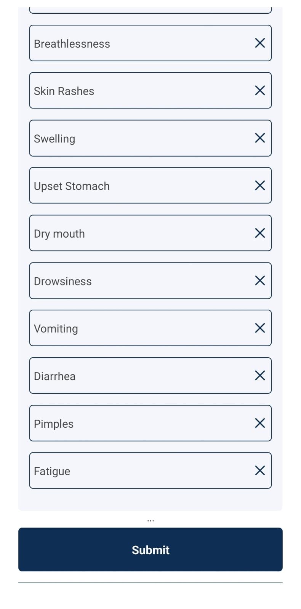
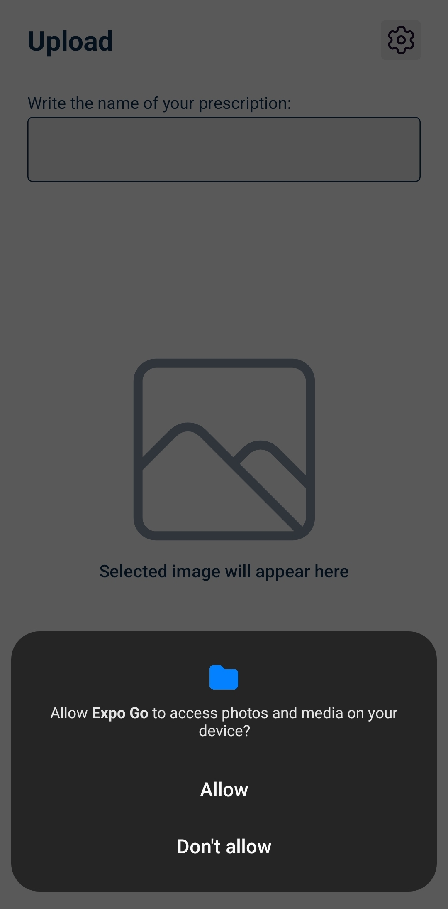

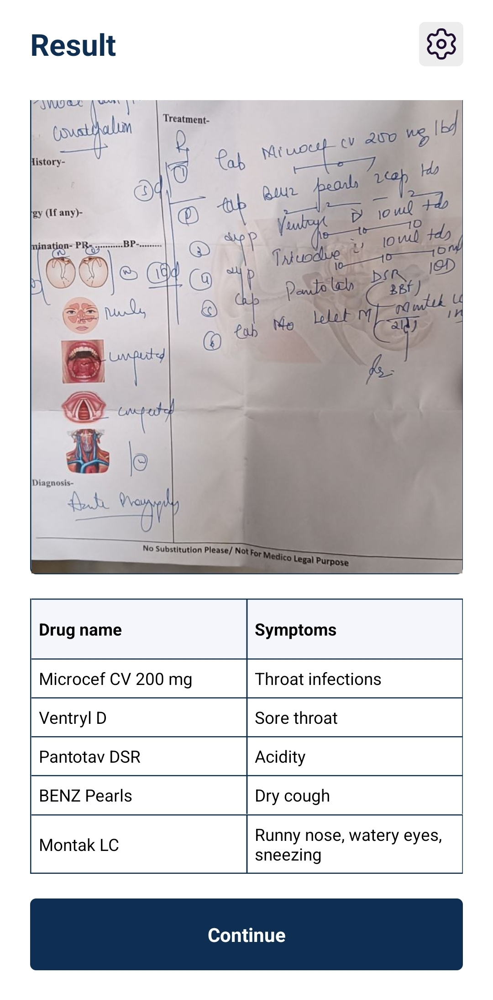
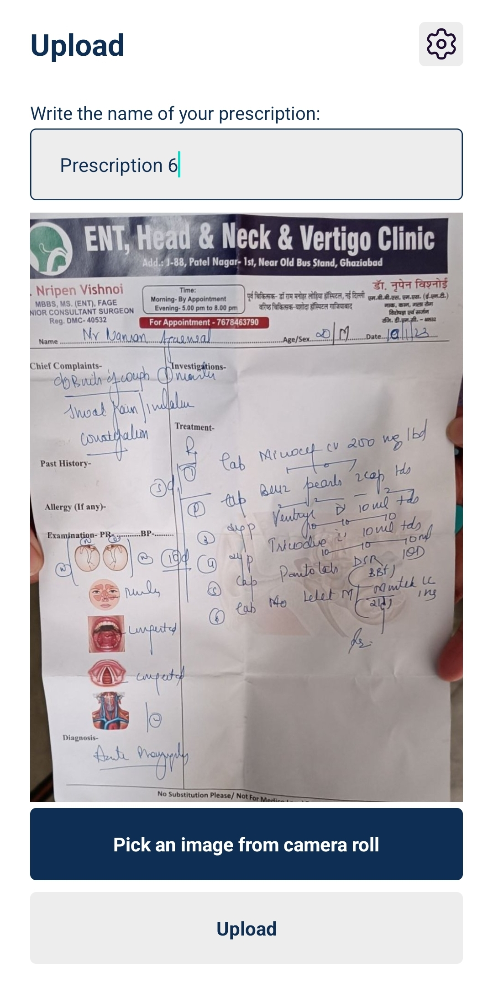
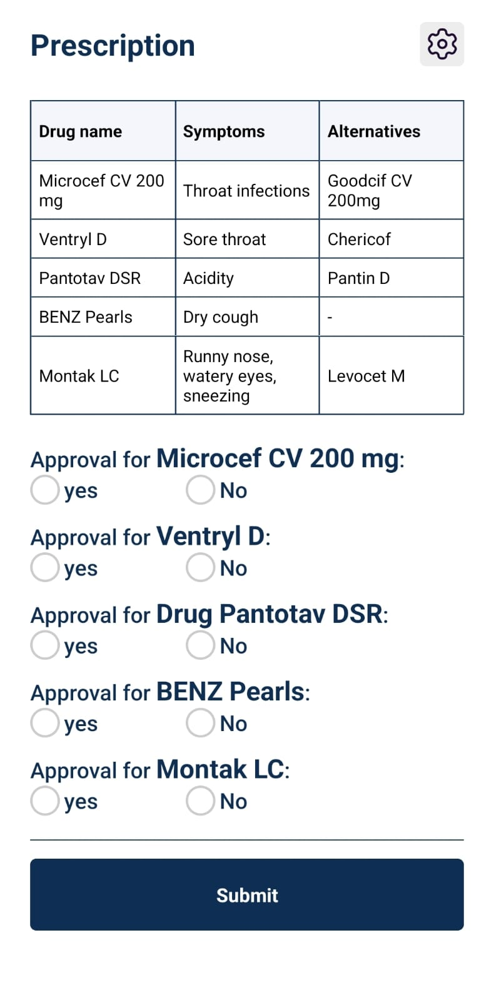
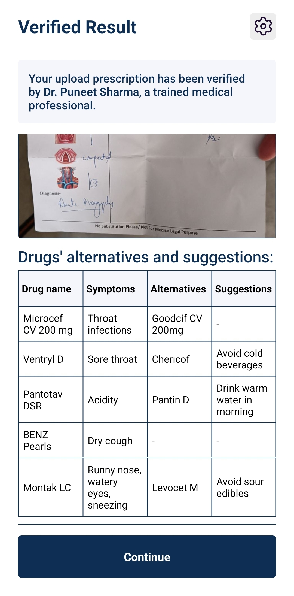

## Installation

To install the MedAssist app, follow these steps:

### For the Web Application (NextJS)

1. Clone the repository from GitHub
2. Navigate to the `web` folder
3. Install the dependencies using `npm install`
4. Run the development server using `npm run dev`

### For the Mobile Application (React Native with Expo)

1. Clone the repository from GitHub
2. Install Expo CLI using `npm install --global expo-cli`
3. Navigate to the `app` folder
4. Install the dependencies using `npm install`
5. Run `expo start` to start the application
6. Install the Expo Go app on your mobile device
7. Scan the QR code in the Expo DevTools web page or console to open the app on your device

## Contributors

The MedAssist app was created by:

- [Nishank Priydarshi](https://github.com/theMillenniumFalcon)
- [Aditya Kumar](https://github.com/akaditya394)
- [Vansh Agarwal](https://github.com/vanshagarwal18)
- [Naman Agarwal](https://github.com/NamanAgarwal214)

Contributions to the project are always welcome!

## License

The MedAssist app is licensed under the [insert license here].

### tasks:

- [x] <s>UI design</s>
- [x] <s>basic code implmentation on webapp</s>
- [x] <s>server authentication logic</s>
- [ ] figure out how user can add side effects after getting table of side effects and alt.
- [ ] complete the handleSubmit function definitions
- [ ] complete auth UI in app and link with server
- [ ] explore free tier for google cloud
- [ ] Add vision API
- [ ] research about the model and elaboration form logic

### future scope:

- add natural language processing capabilities while monitoring side-effects

### resources used:

- https://expo.dev/
- https://discord.com/blog/how-discord-achieves-native-ios-performance-with-react-native
